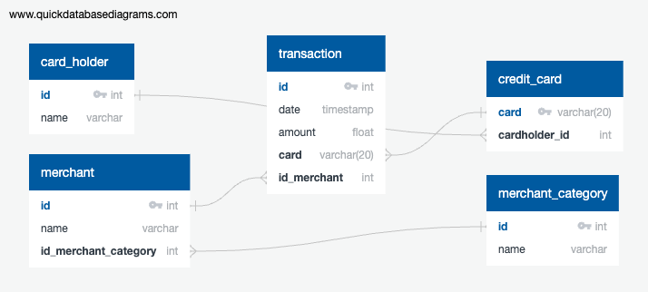
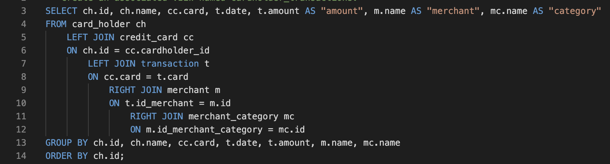
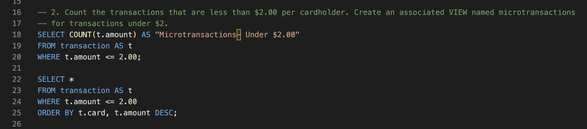
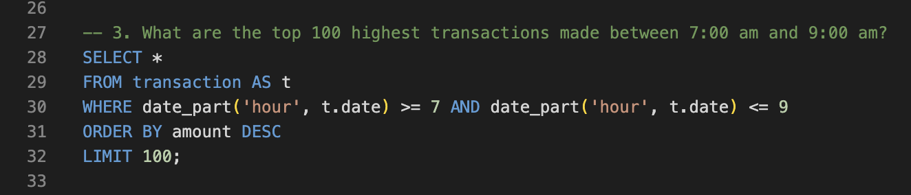
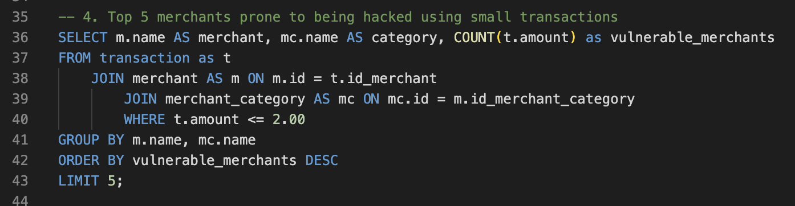
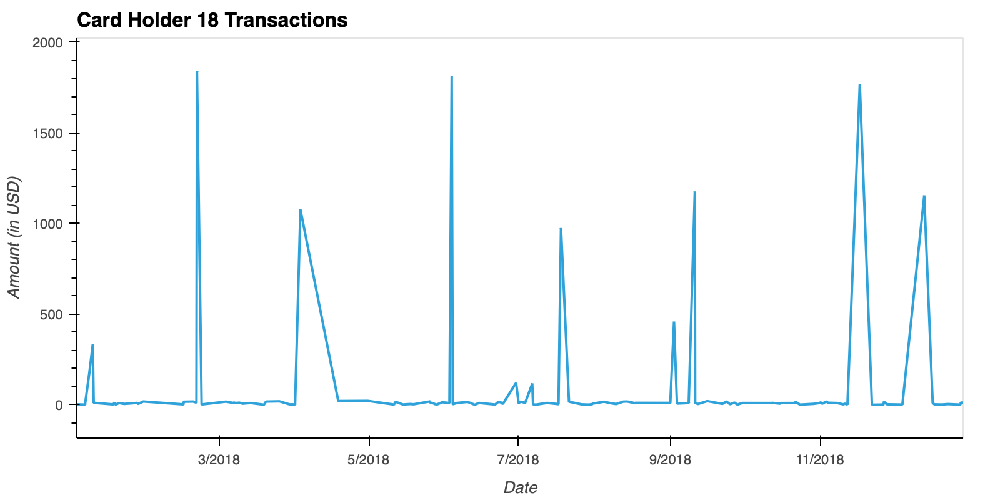
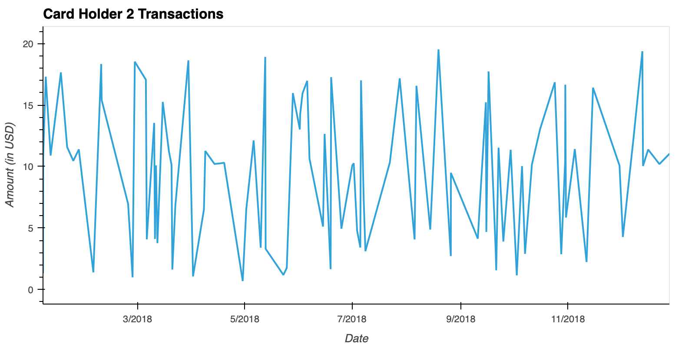
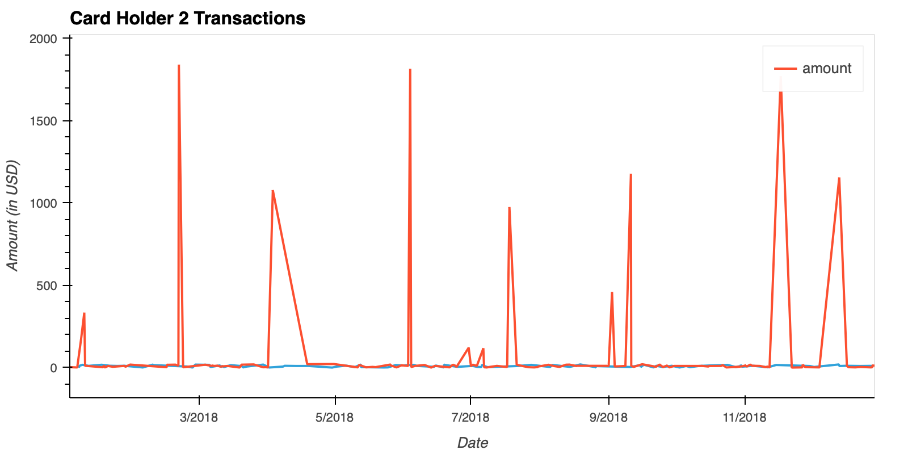
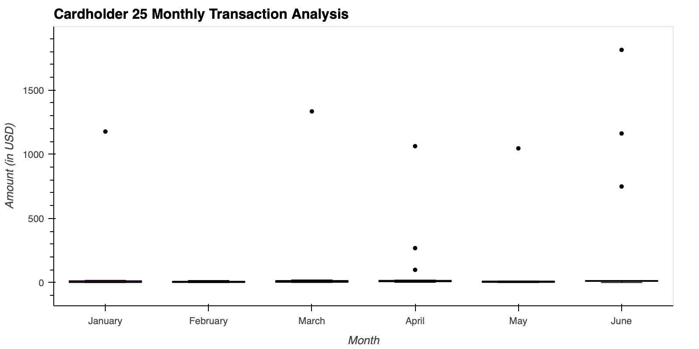

# SQL-Homework

*[Credit Card Fraudster by Richard Patterson](https://www.flickr.com/photos/136770128@N07/42252105582/) | [Creative Commons Licensed](https://creativecommons.org/licenses/by/2.0/)*

## Background

Fraud is prevalent these days, whether you are a small taco shop or a large international business. While there are emerging technologies that employ machine learning and artificial intelligence to detect fraud, many instances of fraud detection still require strong data analytics to find abnormal charges.

I will apply my knowledge of SQL to analyze historical credit card transactions and consumption patterns in order to identify possible fraudulent transactions.

### Table of Contents

1. [Data Modeling](#Data-Modeling):
Define a database model to store the credit card transactions data and create a new PostgreSQL database using the model.

2. [Data Engineering](#Data-Engineering): Create a database schema on PostgreSQL and populate the database from the CSV files provided.

3. [Data Analysis-SQL](#Data-Analysis-SQL): Analyze the data to identify possible fraudulent transactions trends data, and develop a report of your observations.

4. [Data Analysis-Python](#Data-Analysis-Python): Create a visual analysis of the transactions data in a Python Notebook
---

## Files

* [card_holder.csv](Data/card_holder.csv)
* [credit_card.csv](Data/credit_card.csv)
* [merchant.csv](Data/merchant.csv)
* [merchant_category.csv](Data/merchant_category.csv)
* [transaction.csv](Data/transaction.csv)

### Data Modeling

Create an entity relationship diagram (ERD) by inspecting the provided CSV files using [Quick Database Diagrams](https://www.quickdatabasediagrams.com) to create the model.

### Data Engineering

Using the database model as a blueprint, create a database schema for each table and relationship, specifying data types, primary keys, foreign keys, and any other constraints defined.

#### Database Model
[FraudDB Schema](SQL_Code/FraudDB_Schema.sql)

### Data Analysis-SQL
#### Part 1:

The CFO of the firm has requested a report to help analyze potential fraudulent transactions. Using a newly created database, generate queries that will discover the information needed to answer the following questions, create a view for each query, then use the repository's ReadME file to create a markdown report I can share with the CFO.:

* Some fraudsters hack a credit card by making several small transactions (generally less than $2.00), which are typically ignored by cardholders. 

  * How can you isolate (or group) the transactions of each cardholder?

  

  * Views Output: [Isolated Cardholder Transactions](Query_Views/cardholder_transactions.csv)

  * Count the transactions that are less than $2.00 per cardholder. 

  

  Views Output: [Transactions Under $2.00](Query_Views/microtransactions.csv)
  
  
  * Is there any evidence to suggest that a credit card has been hacked? Explain your rationale.
  *Maybe. Given that fraudsters can hack credit cards by making small transactions under $2, it could be argued that credit cards with the highest 
  number of these small transactions may have been hacked.* 

* Take the investigation a step futher by considering the time period in which potentially fraudulent transactions are made. 

  * What are the top 100 highest transactions made between 7:00 am and 9:00 am?

  

  Views Output: [Top 100 Highest Transactions Between 7AM and 9AM](Query_Views/top_morning_transactions.csv)

  * Do you see any anomalous transactions that could be fraudulent?
  *Yes, I noticed some transactions that would be highly unusual given the timeframe.*
    * *Analysis of the top_morning_transactions table shows a transaction of $1894.00 by Cardholder 1 at 7AM at the Curry, Scott and Richardson bar, cross-checked from the cardholder_transactions table.* 
    * *Since bars typically open in the evening, a high dollar bar transaction in the morning is likely fraudulent.*

  * Is there a higher number of fraudulent transactions made during this time frame versus the rest of the day?
  *No– while many cardholders, such as cardholders 11, 10, 12, 20, 13, and more shared a pattern of numerous suspicious low-pattern transactions, they tended to occur at all times. 

  * If you answered yes to the previous question, explain why you think there might be fraudulent transactions during this time frame.

* What are the top 5 merchants prone to being hacked using small transactions?

Views Output: [Top 5 Most Vulnerable Merchants](Query_Views/most_vulnerable_merchants.csv)

### Data Analysis-Python
#### Part 2:

The CFO has also requested detailed trends data on specific card holders. Query the database in the [Python notebook](visual_data_analysis.ipynb) and generate visualizations that supply the requested information as follows, then add the visualizations and observations to the markdown report:      

* The two most important customers of the firm may have been hacked. Verify if there are any fraudulent transactions in their history. For privacy reasons, you only know that their cardholder IDs are 2 and 18.

  * Using hvPlot, create a line plot representing the time series of transactions over the course of the year for each cardholder separately.

  

   
  
  * Next, to better compare their patterns, create a single line plot that contains both card holders' trend data.

    

  * What difference do you observe between the consumption patterns? Does the difference suggest a fraudulent transaction? Explain your rationale.
    * *Cardholder 2 exhibited consistent very low dollar transactions (between 0 and 20 dollars) throughout the entire year.*
    * *Cardholder 18 followed this trend, but every two months, would have high dollar transactions of varying amounts. Given the abnormality, they
    could potentially be fraudulent.*

* The CEO of the biggest customer of the firm suspects that someone has used her corporate credit card without authorization in the first quarter of 2018 to pay quite expensive restaurant bills. Again, for privacy reasons, you know only that the cardholder ID in question is 25.

  * Using hvPlot, create a box plot, representing the expenditure data from January 2018 to June 2018 for cardholder ID 25.

  
  
  * Are there any outliers for cardholder ID 25? How many outliers are there per month?
    * *Yes. There are on average one high dollar outlier of varying amount each month.*

  * Do you notice any anomalies? Describe your observations and conclusions.
    * *With there being three over-$500 transactions in June and one over-$1000 transaction in January, March, April, and May each throughout a year of consistent
    transaction below $20, it could be argured that these large outlier transactions may have been fraudulent.*
